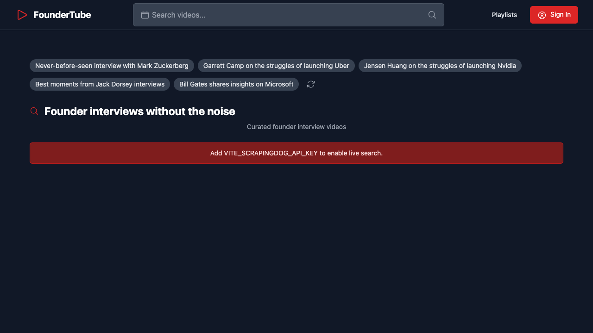

# FounderTube

I have a playlist of about 700 videos from different founders and operators I've collected on YouTube over the years. A lot of the best ones are these random 25-minute interviews or talks from 2014 with 3,000 views. So I built this to automatically surface those types of videos.

For the home feed, I created a list of 30–50 of the most impressive founders and companies, then a list of queries that would find good videos from them. The home feed randomly combines those two, sets the minimum duration and date filters, then shows you the videos.

For searching, you can filter by year range, before a certain year, exact duration range, etc.



## Features

- Pre-generated searches built around founders, companies, and business topics
- Long-form YouTube search with date and duration filters
- Discovery of older, high-signal interviews that are otherwise difficult to surface
- Focused embedded player
- Browser-local playlists with no account or database required
- Responsive React and Tailwind interface
- Installable PWA

## Run locally

Requirements: Node.js 20+ and npm.

```bash
npm install
cp .env.example .env.local
npm run dev
```

Add your own `VITE_SCRAPINGDOG_API_KEY` for live search. `VITE_YOUTUBE_API_KEY` is optional and adds video/channel metadata to the watch page. The landing page and navigation work without keys.

Because Vite exposes `VITE_` variables to the browser, use a server-side proxy for paid production credentials. If you use a browser-visible YouTube key, restrict it by domain and API in Google Cloud.

## Commands

```bash
npm run build
npm run lint
npm run preview
```

## Project structure

- `src/components/HomePage.tsx` — founder discovery and suggestions
- `src/components/SearchPage.tsx` — filtered search results
- `src/components/VideoPlayer.tsx` — focused playback and metadata
- `src/components/PlaylistsPage.tsx` — local playlist management
- `src/lib/blobPlaylists.ts` — browser-local persistence retained behind the original interface

## License

MIT. YouTube and third-party content remain subject to their respective terms.
